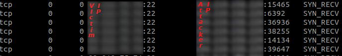
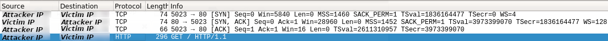
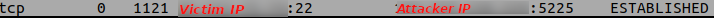
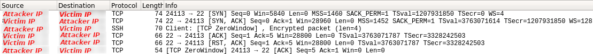
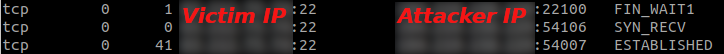
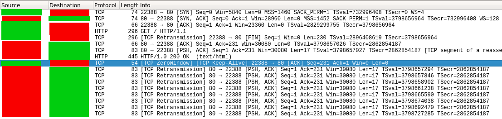
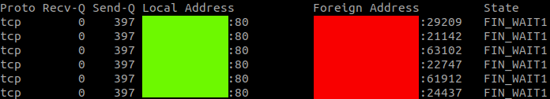
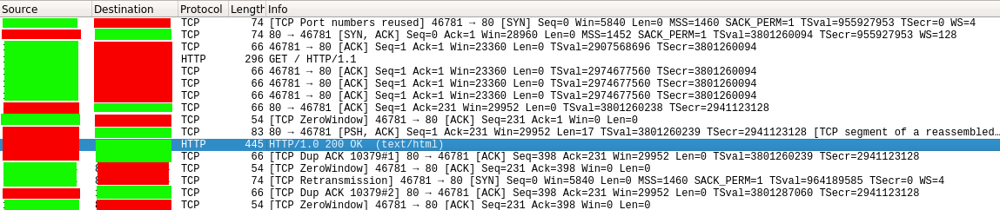
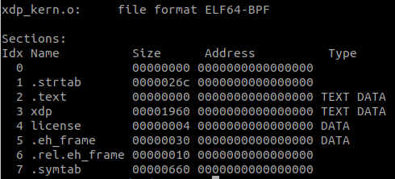

\
University of Thessaly, Department of Electrical and
Computer Engineering

* **Nikitopoulos Georgios** - *Author* 

* **Christos D. Antonopoulos** - *Supervisor* 

A project report submitted for the class of *HY401 Special Topics*

Abstract
========
Distributed Denial of Service (DDoS) attacks pose a threat to any online service across all industries. These attacks exhaust the resources that would otherwise serve legitimate users by leveraging the power of many compromised devices (botnet), thus making it unavailable for common users. In 2018 there were several attacks at 1.3 TBps and one measured at 1.7 TBps with targets ranging from Github to small organizations being affected by test attacks. This suggests that there is a big need for robust and efficient defense mechanisms that mitigate such attacks. The option used in this project is the eXpress Data Path, a programmable network data path in the Linux Kernel that processes packets in the lowest point of the network stack, which is what enables it to be advertised as a high performance solution. The method of attack utilized in this project is Sockstress, a very powerful TCP socket stress framework that was first demonstrated in 2008. Various options of attack by Sockstress will be described and outlined. Each attack mode will be mitigated by making additions in our XDP/eBPF program. When writing C programs for BPF, there are a couple of pitfalls to be aware of, compared to usual application development with C. Such pitfalls are encountered and the workarounds are documented. A single-host testing environment is created that is designed to be very easily deployable to a multi-host network that would, in further work, enable us to make more realistic measurements across different hardware.

Acknowledgements

A big thank you to GRNET and Dimitris Mitropoulos for providing the subject of this project as well as the infrastructure that was required.

System Setup
============

The system chosen for the development of this implementation is a
virtual machine hosted in GRNET’s (Greek NREN) clouding platform
 okeanos-knossos. The virtual machine was updated to Linux Kernel 4.18
in order to be able to be compatible with XDP (support available since
Linux Kernel Version 4.8, generic mode available since 4.12 and
virtio\_net drivers since 4.10) and JIT compiling (since version 4.18
for x86\_32 architectures). Further information on the features
supported regarding XDP, eBPF and JIT in each version of the Linux
Kernel can be found in
<https://github.com/iovisor/bcc/blob/master/docs/kernel-versions.md#xdp>

Zero-copy Networking, eBPF and Just-In-Time compilation
-------------------------------------------------------

Kernel bypass is the technique we use in order to skip the kernel’s
networking layer and do all the packet processing from user-space. By
doing this we avoid overhead introduced by the Kernel which is
accumulative as the attack loads increase. This is the technique that
leaders of the industry in DDoS mitigation were utilizing in the past
(before XDP was introduced).

This technique gave way to a new scheme which operates in the opposite
way by moving user-space programs (filters usually) into the kernel’s
realm. This results in great packet-processing speedups because it
allows us to filter packets as soon as they reach the Network Interface
Card (NIC) and is possible with the use of eBPF programs (extended
Berkeley Packet Filtering). BPF utilizes bytecode which is translated
into native code for the architecture using a Just-In-Time (JIT)
compiler that does this in real time. This type of technique is also
called **Zero-Copy Networking** due to avoiding double copies of the
same packet between Kernel and user-space by utilizing shared memory and
therefore avoiding significant performance overheads.

Since BPF programs run inside the Kernel, they have to be limited in
order to be safe to run so that they do not affect the system’s
stability. This is achieved by a verifier that checks for backward jumps
and therefore ensuring termination. This means that BPF programs are not
Turing-Complete and that we have to mind this limitation.

Building BPF programs outside of the Kernel Tree
------------------------------------------------

In order to build XDP/eBPF we use Clang and llvm. The version of Clang
that supports XDP/eBPF is &gt;= 3.4.0 and the version of llvm is &gt;=
3.7.1. In order to figure out the versions of Clang and llvm currently
on someones system one can run:

    llc --version

Listing 1.1: Command code for llc version

In our system this command outputs LLVM version 6.0.0

The Clang version is retrieved by running

    clang --version

Listing 1.2 Command code for clang version

In our system this command outputs clang version 6.0.0-1ubuntu2.

In order to make a program that uses XDP one needs to make two have two
files containing code, one for kernel-space and one for user-space.
Usually if the latter is named *filename.c* then the former is named
*filename\_kern.c*. BPF programs need to be compiled against the right
headers that contain the BPF definitions. In order to simplify the
process I copied *bpf\_helpers.c*, a header file in the kernel source
that contains convenience functions, in the project directory. Next
there was a need for a Makefile that contained all the include paths of
our programs as well as the flags needed by gcc and clang in order to
compile XDP/BPF programs.

     CLANG_PATH_GCC=/usr/lib/gcc/x86_64-linux-gnu/7/include
     CLANG_PATH_ARCH=/usr/src/linux-source-4.18.0/linux-source-4.18.0/arch/x86/include
     CLANG_PATH_ARCH_GENERATED=/usr/src/linux-source-4.18.0/linux-source-4.18.0/arch/x86/include/generated
     CLANG_PATH_KERNEL_HEADERS=/usr/src/linux-source-4.18.0/linux-source-4.18.0/include
     CLANG_PATH_X86_UAPI=/usr/src/linux-source-4.18.0/linux-source-4.18.0/arch/x86/include/uapi
     CLANG_PATH_X86_UAPI_GENERATED=/usr/src/linux-source-4.18.0/linux-source-4.18.0/arch/x86/include/generated/uapi
     CLANG_PATH_UAPI=/usr/src/linux-source-4.18.0/linux-source-4.18.0/include/uapi
     CLANG_PATH_UAPI_GENERATED=/usr/src/linux-source-4.18.0/linux-source-4.18.0/include/generated/uapi
     CLANG_PATH_TESTING_TOOLS=/usr/src/linux-source-4.18.0/linux-source-4.18.0/tools/testing/selftests/bpf
     CLANG_PATH_TOOLS=/usr/src/linux-source-4.18.0/linux-source-4.18.0/tools/lib/bpf
     CLANG_PATH_KCONFIG=/usr/src/linux-source-4.18.0/linux-source-4.18.0/include/linux/kconfig.h
     LIBBPF=/usr/src/linux-source-4.18.0/linux-source-4.18.0/tools/lib/bpf/libbpf.a
     
     GDB_PATH_KERNEL_HEADERS=/usr/src/linux-source-4.18.0/linux-source-4.18.0/usr/include
     GDB_PATH_TOOLS=/usr/src/linux-source-4.18.0/linux-source-4.18.0/tools/lib
     GDB_PATH_TOOLS_INC=/usr/src/linux-source-4.18.0/linux-source-4.18.0/tools/include
     GDB_PATH_TOOLS_PERF=/usr/src/linux-source-4.18.0/linux-source-4.18.0/tools/perf

Listing 1.3: Include paths for Makefile

The path for the Linux Kernel source is located at
/usr/src/linux-source-4.18.0/. The paths that start with the CLANG
keyword are used to compile the kernel-space programs and the paths that
start with GDB are used in order to compile the user-space programs.

All of the CLANG files are combined in the CFLAGS variable, all the GDB
flags are combined in the GDB\_FLAGS variable, LIBFLAGS is the LIBBPF
variable with the -l appended and IFLAGS is:

    IFLAGS=$(CLANG_PATH_KCONFIG) \
    	   -I$(CLANG_PATH_TOOLS) \
    	   -I$(CLANG_PATH_TESTING_TOOLS) 

Listing 1.4: IFLAGS for Makefile

So the command that builds the kernel program is:

    clang  -nostdinc -isystem $(CFLAGS) -include $(IFLAGS)\
        -D__KERNEL__ -D__BPF_TRACING__ -Wno-unused-value -Wno-pointer-sign \
        -D__TARGET_ARCH_x86 -Wno-compare-distinct-pointer-types \
        -Wno-gnu-variable-sized-type-not-at-end \
        -Wno-address-of-packed-member -Wno-tautological-compare \
        -Wno-unknown-warning-option  \
        -O2 -emit-llvm -c xdp_kern.c -o -| llc -march=bpf -filetype=obj -o xdp_kern.o

Listing 1.5: Clang command for Makefile

and the commands that build the user-space program are:

    gcc -Wp,-MD,.xdp_user.o.d -Wall -Wmissing-prototypes -Wstrict-prototypes -O2 -fomit-frame-pointer -std=gnu89 $(GDB_FLAGS) -c -o xdp_user.o xdp_user.c
    gcc  -o xdp xdp_user.o  /usr/src/linux-source-4.18.0/linux-source-4.18.0/tools/lib/bpf/libbpf.a -lelf

Listing 1.6: gdb commands for Makefile

Sockstress
==========

Sockstress is a Denial of Service tool developed by Jack C. Louis
(Outpost 24) that is used to attack systems in the internet over TCP.
What is interesting about Sockstress is the fact it usually utilizes the
resources (RAM) of the victim’s systems in such a way that it causes
them to crash and renders them unable to shutdown in a normal way. The
victim would then have to do a hard reboot of the system to recover it.
Unfortunately the author of this attack died in a tragic fire in 2009
leaving many details about the attack unpublished. As such, the Denial
of Service mechanism of action is still unknown and experts are advising
to treat this as a typical DoS attack and block the responsible IP
address.

DoS Process
-----------

In order to perform a successful Sockstress attack the attacker would
have to firewall his source IP addresses in order to prevent his own OS
from interfering with his own attack, as there will be incoming packets
with a RST flag and the attacker’s kernel will reset the sockets. One of
the authors of Sockstress (Robert E. Lee) has documented a case of
accidentally DoSing one’s self by using this local firewall method and
thus an alternate method of attack vector protection is used.

    iptables -A OUTPUT -p TCP --tcp-flags rst rst -d <insert victim's ip address> -j DROP

Listing 2.1: iptables command for local firewall

### FantaIP

This alternate method is implemented by a tool called FantaIP in the
source code created by the original creators of Sockstress. FantaIP
essentially creates spoofed IP addresses (“phantom” IP addresses, hence
the name fantaIP) and it does that by generating ARP replies when the
target sends ARP requests trying to find the spoofed addresses. There
were many failed attempts on building FantaIP for Ubuntu 18.04 as well
as many reported cases of individuals characterizing it unusable for
modern operating systems (FantaIP works on old versions of Slackware).
Therefore there was a need to write a tool that would implement the same
functionality and this simple Python script that utilizes Scapy does
that.

    #This code is a modified version of Sam Browne's arppoi.py tool 
    import sys
    from scapy.all import *

    def findARP(p):
      op = p.sprintf("%ARP.op%")
      if op == "who-has":
        pdst = p.sprintf("%ARP.pdst%")
        len = pdst.__len__()
        if len > 11:                       
          if  "192.168.1." in pdst and pdst != "192.168.1.1":
            print "first if detected"
            psrc = p.sprintf("%ARP.psrc%")
            print "ARP detected: ", op, " ", pdst, " tell ", psrc
            B = ARP()
            B.op = "is-at"
            B.pdst = psrc
            B.psrc = pdst
            B.hwsrc = "34:02:86:6f:2d:df"  # MAC Address of Attacker
            B.hwdst = "ff:ff:ff:ff:ff:ff"
            print "Sending ", B.summary()
            send(B)
    sniff(prn=findARP)

Listing 2.2: Python script for ARP spoofing arp_spoofer.py

### Sockstress

There are several implementations of Sockstress on the internet the most
popular one being [defuse.ca’s Sockstress
implementation](https://github.com/defuse/sockstress) which is limited
to Sockstress’s most basic usage which is basically described in
Figure 2.1.

 

 Figure 2.1: Sockstress Basic Sequence 

What Sockstress does in this mode is send a SYN packet to the victim’s
IP address with window size 59395 and as it receives the ACK reply from
the target it sends back a TCP ACK packet with zero window length. This
mode of attack is referred to by the [Wikipedia article on
sockstress](https://en.wikipedia.org/wiki/Sockstress) as [*Zero window
connection stress*]{}.

There are however many more attack scenarios that are not covered by the
aforementioned implementation of Sockstress. Such attack scenarios are:

-   TCP small window

-   TCP Segment Hole

-   TCP REQ FIN pause

-   TCP activate reno pressure

as well as the aforementioned Zero window connection one. An
implementation that implements these functions can be found in [Pekka
Pietikäinen repository](https://github.com/ppietikainen/sockstress)
which is 6 years old. The age of this repository imposed problems on its
installation in Ubuntu 18.04 which is a modern version of Linux. In
order to make it work the [*pcap.h*]{} header file in /usr/include/pcap
had to be modified with these added definitions:

    #define TH_FIN 0x01
    #define TH_SYN 0x02
    #define TH_RST 0x04
    #define TH_PSH 0x08
    #define TH_ACK 0x10
    #define TH_URG 0x20
    #define TH_ECE 0x40 
    #define TH_CWR 0x80  

 Listing 2.3: Added defines for pcap.h
 

Running attacks
---------------

All the attacks described in this section are ran by the source code in
[Pekka Pietikäinen
repository](https://github.com/ppietikainen/sockstress) with super user
priviledges due to Sockstress’s need of raw socket usage.

### Zero Window Connection Attack

The Zero Window Connection Attack packet sequence is described in
Figure 2.1. This attack is started with this
command:

    sudo ./sockstress -A -c-1 -d <insert victim ip> -m-1 -Mz -p22,80 -r300 -s192.168.1.128/25 -vv

Listing 2.4: Command code for Zero Window Connection Attack

A Zero Window attack makes the victim system to continually ask the
attacker system in order to figure out when it can send data (due to the
protocol it needs to know when the zero window opens). This of course
keeps connections open and wastes the victim’s system resources. Note
that the SYN Cookies do not protect the machine from the attack as the
connections from the adversaries are in a SYN\_RECV state. This was
tested by enabling the SYN Cookies protection by appending this line at
/etc/sysctl.conf

    net.ipv4.tcp_syncookies = 1

Listing 2.5: Line that enables SYN Cookies

then running a SYN Flood attack with hping with this command

    sudo hping3 -i u1 -S -p 80 <insert victim IP here> 

Listing 2.6: Command that SYN Floods

in order to see that no connections were being made by running

    sudo netstat -tn

Listing 2.7: netstat command
 
While on the other hand the sockstress attack created SYN\_RECV
connections on the victim machine. The output of the same netstat
command at this time yielded a number of connections of this form:

Figure 2.2: SYN_RECV list output

### TCP Small Window Stress Attack

The small window attack works by setting the window size to a small
number such as 4 during the TCP handshake and then sending a payload
such an HTTP GET request. This creates an open TCP connection in which
all the responses from the payload request are all split into tiny
chunks and therefore wasting system resources.
Figure 2.3 shows this exact functionality in a
port 80 attack (HTTP). An attack at say port 22 (SSH) would contain the
SSH analogue of this payload.

Figure 2.3: Sockstress small window size attack sequence

This attack is very different from the Zero Window Connection attack as
it sets the window size in the TCP options field of the packet by
changing the window scale factor instead of the window size TCP header
field and thus requires a different method of mitigation.

This attack version can be run with this command:

    sudo ./sockstress -A -c-1 -d <insert victim IP> -m-1 -Mw -p22,80 -r300 -s192.168.1.64 -vv

Listing 2.8: Command code for Small Window Connection Attack

It should be noted that when the victim is under attack the netstat
command at Listing 2.7 outputs a list of ESTABLISHED
connections of this form:

Figure 2.4: ESTABLISHED connection, netstat

### TCP Segment Hole Attack

In this attack upon the 3-way handshake the SYN packet is setting the
window-size to 4 bytes long and during the last ACK the attacker sends 4
bytes followed by a packet that Zeros the window as we can see in
Figure 2.5. This attack is verified to be increasing
the memory usage of the system unlike the other attacks by using htop on
the victim’s machine and observing the spike during the attack.

Figure 2.5: Segment Hole packet sequence

\
This attack was performed with this command:

    sudo ./sockstress -A -c-1 -d <insert victim ip> -m-1 -Ms -p22 -r300 -s<insert source IP> -vv

Listing 2.9: Command code for Segment Hole Attack

It also seams to be leaving the connections at a mix of SYS\_RECV,
ESTABLISHED, and FIN\_WAIT1 states as shown by the output of the command
at Listing 2.7 in Figure 2.6

Figure 2.6: SYS_RECV, ESTABLISHED and FIN_WAIT1 states, Segment Hole Attack

### REQ FIN Pause Stress

In order to make this attack work there was a need to raise an HTTP
server in our victim machine. This was achieved by running this command
in the directory that we wanted to serve:

    sudo python -m SimpleHTTPServer 80

Listing 2.10: Command for HTTP Server

Then the attack was run by doing:

    sudo ./sockstress -A -c-1 -d 83.212.75.74 -m-1 -MS -p80 -r10 -s192.168.1.64 -vv

Listing 2.11: Command for REQ FIN Attack

In this attack a connection is first started with the victim followed by
a PSH packet that contains an HTTP GET request of the page. Then after
the Server replies an ACK packet with Zero Window Length is sent by the
Attacker. This exact packet sequence is shown in
Figure 2.7

Figure 2.7: REQ FIN Attack Packet sequence, where Green is the attacker IP and Red is the victim IP

This makes the victim machine have sockets left in the FIN\_WAIT1 state
as shown in Figure 2.8\
After enough sockets left in this state the Server cannot communicate
TCP properly.

Figure 2.8: REQ FIN Attack FIN_WAIT1 States, where Green is the attacker IP and Red is the victim IP

### TCP Activate Reno Pressure

This attack works by activating a congestion control algorithm called
TCP Reno and thus putting load into the victim’s machine. TCP Reno is
activated when 3 duplicate ACKs are received. It does that by creating a
connection with the victim’s machine, then it sends the TCP payload
(HTTP GET request) followed by 3 duplicate ACK packets. Then it sends
Zero Window packets. This functionality is shown in
Figure 2.9. All the sockets have ESTABLISHED
connections in this attack

Figure 2.9: Activate Reno Attack Packet Sequence, where Green is the attacker IP and Red is the victim IP

XDP Mitigation
==============

All of the afformentioned attacks have one thing in common. The small
window size packet at the beginning of the TCP Handshake. The only
difference is between the Zero Window Attack and the rest of them which
is due to the fact that the Zero Window Connection attack sets the
window size in the TCP Header field of the packet instead of changing
the window scale factor in the TCP Options field and thus it requires a
different method of filtering.

Userspace part: xdp\_user.c
---------------------------

The userspace part of the code is kept simple. What this module does is
essentially call the kernel-space module (achieved by the
bpf\_prog\_load\_xattr and bpf\_set\_link\_xdp\_fd function calls in
lines 30 and 40 in Listing 3.1 ) and set the mode of XDP
to SKB mode(in line 28, Listing 3.1). SKB is a driver
independent mode that allows XDP to process packets after socket buffer
and direct memory allocation is completed. This makes a larger number of
instructions to be run before the XDP drop and thus is not ideal in our
case where we want as little overhead as possible but it is chosen due
to the fact that testing and developing can be done without worrying
about the hardware or the drivers.

    #include <linux/bpf.h>
    #include <linux/if_link.h>
    #include <libgen.h>
    #include <stdlib.h>

    #include "bpf_util.h"
    #include "bpf/libbpf.h"
    #include "bpf/bpf.h"

    static int ifindex;
    static __u32 xdp_flags;

    int main(int argc, char *argv[]){
        struct bpf_prog_load_attr prog_load_attr = {
            .prog_type  = BPF_PROG_TYPE_XDP,
        };

        int prog_fd;
        struct bpf_object *obj;
        char filename[256];
        
        ifindex = strtoul(argv[1], NULL, 0);
        snprintf(filename, sizeof(filename), "%s_kern.o", basename(argv[0]));

        prog_load_attr.file = filename;
        //prog_load_attr.ifindex = ifindex;
        xdp_flags |= XDP_FLAGS_SKB_MODE;

        if(bpf_prog_load_xattr(&prog_load_attr, &obj, &prog_fd)){
            printf("[-] Error loading object");
            return 1;
        }

        if(!prog_fd){
            printf("[-] Error loading file\n");
            return 1;
        }
        
        if(bpf_set_link_xdp_fd(ifindex, prog_fd, xdp_flags) < 0){
            printf("[-] Set link xdp fd failed\n");
            return 1;
        }
        
        return 0;
    }

Listing 3.1: Userspace code xdp_user.c

Code sections 1-9 are library includes, line 24 sets the filename of the
kernel-space program to xdp\_kern.c, lines 35-39 is the file descriptor
error check and another error check is performed at line 40 where the
kernel-space program is called.

Kernel-space part: xdp\_kern.c
------------------------------

This part essentially does all the profiling and the dropping of the
packets. The SEC() macro (in line 51 of Listing 3.3) uses
the \_\_attribute\_\_ directive for the gnu compiler to create a code
segment called xdp. The output of command in Listing 3.2 is
shown in Figure 3.1 and it verifies the creation of the code
segment named xdp.

    llvm-objdump -h xdp_kern.o

Listing 3.2: Command for objdump

Figure 3.1: objdump code segments output

The binary containing the eBPF program is the xdp\_kern.o file and it is
a normal ELF binary, it can be inspected with tools like
*llvm-objdump* and *elftools*. A bpf instruction is 8 bytes
long, by this information and by looking at the size at
Figure 3.1 we can derive that this program contains 812 bpf
instructions. This information is important due to the fact that the
verifier mentioned in the first chapter checks requires for all eBPF
programs to have less than 4096 instructions so that by design all
programs terminate quickly.

Function decap\_ipv4 (called in line 69 of Listing 3.3)
essentially extracts the protocol from the header and returns it in the
ipproto variable. It is then checked at line 76 on if it is ICMP (Ping
packet) and the packet is dropped if that is true. This functionality
was implemented as a quick check mechanism to verify that the bpf
program was running from the victim machine with a quick failed ping on
the interface of the attacker machine.

Function decap\_tcp (called at line 82 of Listing 3.3]
filters the Sockstress packets. In line 13 the tcp\_header variable
enables us to filter fields of the tcp header in line 20 where we check
the case that the window size is zero and that the packet is an ACK
packet (Zero Window Connection Attack case). In this case the packet is
dropped with the XDP\_DROP return in Line 21.

Lines 24-35 implement the filtering for the rest attack types. A finite
loop is searching for the TCP option with the small window size. We do
not know a priori the position of the TCP option but what we can know
for sure is that it has a NOP operation TCP Option before the window
size option and that is why we need a for loop that searches for it.
Backward jumps are not permitted in BPF because the verifier checks for
them as well (BPF is not Turing Complete because it needs to ensure a
safe way for the kernel to run code without the risk of crashing). We
can avoid backward jumps though by using the loop unroll directive for
Clang.

    #define KBUILD_MODNAME "bizd"

    #include <uapi/linux/bpf.h>
    #include <linux/in.h>
    #include <linux/if_ether.h>
    #include <linux/ip.h>
    #include <linux/tcp.h>

    #include "bpf_helpers.h"

    static __always_inline
    int decap_tcp(void *data, u64 l3_offset, void *data_end){
        struct tcphdr *tcp_header = data + l3_offset;
        u8 *nop_finder = data + l3_offset + sizeof(tcp_header);
        int i = 0;

        
        if(tcp_header + 1 > data_end)
            return XDP_ABORTED;
        if(tcp_header->window == 0 && tcp_header->ack == 1){
            return XDP_DROP;
        }
        else if(tcp_header->syn == 1){
    #pragma clang loop unroll(full)
            for(i = 0;i < 60; i++){
                if(nop_finder + 4 > data_end){
                    return XDP_PASS;
                }
                if(*nop_finder == 1){
                    if(*(nop_finder+1) == 3 && *(nop_finder+2) == 3 && *(nop_finder+3) == 2){
                        return XDP_DROP;
                    }
                }
                nop_finder++;
            }   
        }else{
            return XDP_PASS;
        }
    }

    //Return protocol number
    static __always_inline
    int decap_ipv4(void *data, u64 l3_offset, void *data_end){
        struct iphdr *ipheader = data + l3_offset;

        if(ipheader + 1 > data_end)
            return 0;
        return ipheader->protocol;
    }

    SEC("xdp")
    int xdp_programme(struct xdp_md *ctx){
        void *data = (void *)(long)ctx->data;
        void *data_end = (void *)(long)ctx->data_end;
        struct ethhdr *eth_header = data;
        u16 h_proto;
        u32 ipproto;

        u64 l3_offset;

        l3_offset = sizeof(*eth_header);
        if(data + l3_offset > data_end){
            //Ethernet header offset is bigger than the
            //packet itself
            return XDP_DROP;
        }
        h_proto = eth_header->h_proto;
        if(h_proto == htons(ETH_P_IP)){
            ipproto = decap_ipv4(data, l3_offset, data_end);
        }

        if(ipproto == 0){
            return XDP_ABORTED;
        }
        
        if(ipproto == IPPROTO_ICMP){
            return XDP_DROP;
        }

        if(ipproto == IPPROTO_TCP){
            l3_offset = l3_offset + sizeof(struct iphdr);
            return decap_tcp(data, l3_offset, data_end);
        }

        return XDP_PASS;
    }

    char _license[] SEC("license") = "MIT";

Listing 3.3: Code for xdp_kern.c 

Lines 11 and 42 are function inlining directives that are necessary as
there are no function calls in BPF. Lines 3-9 are kernel header file
includes and Lines 18-19, 46-47 and 62-66 are necessary error checking
code segments.

Testing Environment
===================

A single-host virtual network testing environment was created with
Docker compose that can be extended easily into a multi-host physical
network. What would enable this extension is Docker Swarm, without the
need of manually modifying the code for the attacks or the IP address of
the target (as nodes have domain names), so that more realistic attack
simulations can be performed over real networks in order to measure the
performance of our XDP implementation. The yaml file in
Listing 4.1 defines this network and the nodes can be
built with two separate Dockerfiles one for the attackers and the other
for the victim.

    version: '2'
    services:
        victim:
            build: 
                context: .
                dockerfile: victim-dockerfile  
            domainname: victim.grnet.com
            hostname: victim.grnet.com
            ports:
             - "800:80"
            restart: always
            networks:
                mynet:
                    aliases:
                     - victim.grnet.com
        attacker1:
            build: 
                context: .
                dockerfile: attacker-dockerfile
            domainname: ddos_peer0.grnet.com
            hostname: ddos_peer0.grnet.com
             - "801:80"
            restart: always
            networks:
                mynet:
                    aliases:
                     - ddos_peer0.grnet.com
    networks:
        mynet:

Listing 4.1: Code for docker-compose.yml

We can then add the commands and specify the images for the victim node
and the attacker nodes in the victim-dockerfile and attacker-dockerfile
respectively. One such dockerfile would have the form of
Listing 4.2

    FROM <Insert image type (Ubuntu 18.04 for the victim and alpine 3.4 for the attackers were used)>
    ADD . /code
    WORKDIR /code
    <Insert Commands in order to prepare each node for the test
    (Compiling and triggering of XDP BPF program commands go here as well as Sockstress building and triggering)>

Listing 4.2: Code for &lt;node-type&gt;-dockerfile

